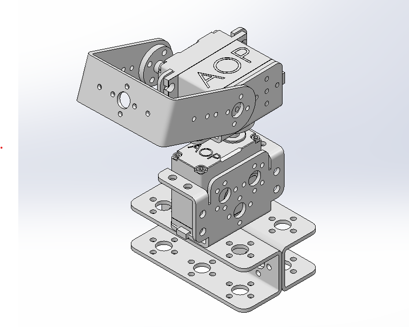

# Mã nguồn thiết kế hệ thống Pantilt theo dõi khuôn mặt 

### Nội dung
1. Sử dụng thuật toán Haar Cascade
2. Sử dụng mô hình Pantilt có 2DOF

## Liên hệ
1. Tác giả : Phạm Hoàng Nam
3. Gmail : phn1712002@gmail.com 
